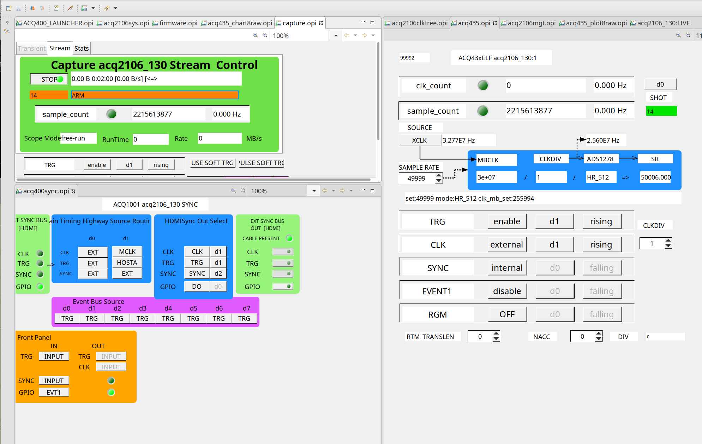
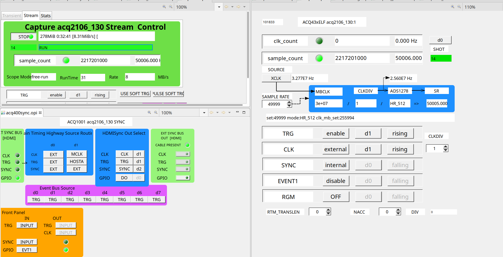
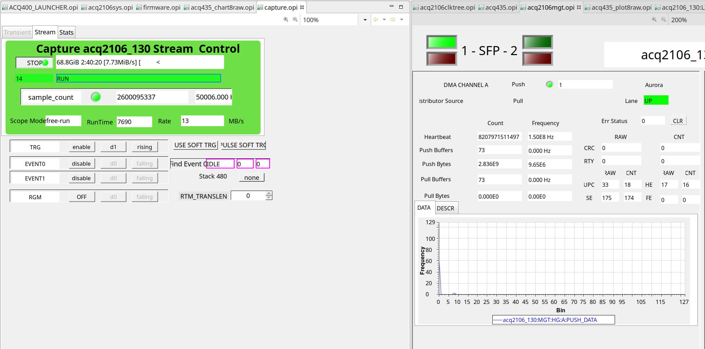
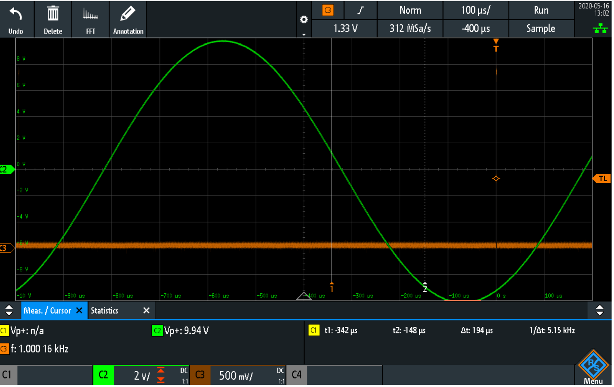
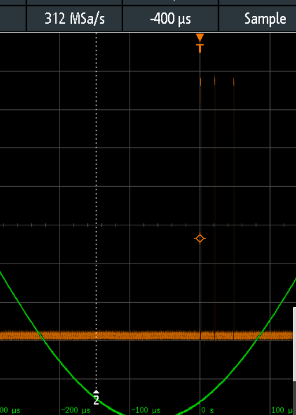
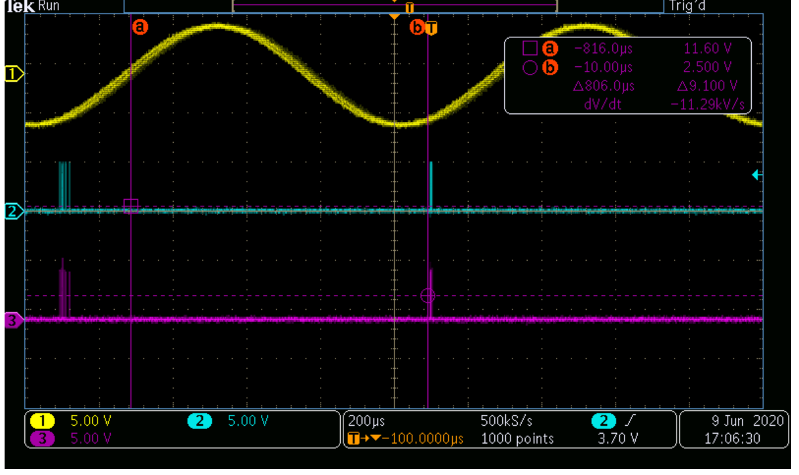

# NEWS32 : example 4 x ACQ2106+ACQ435, located N,E,W,S at distance.
 * units each have a free running clock
 * start continuous capture on AFHBA broadcast TRG
 * instrument system by outputting TRG on FP GPIO at end of each cycle.
 * ./ACQPROC/configs/news32.json defines the whole system
 * ./ACQPROC/configs/n32.json defines a single-box minimal system

# Example Operation with single box:

## First, run a control script to configure the box - we like 49999Hz because that's the highest setting for HR_512 mode : lowest latency with highest SNR
```
./scripts/acqproc_config_freerunning_acq435 --acq435SR 49999 acq2106_130

```
 * View result in cs-studio:


## Now run the embedded control program
```
VERBOSE=0 RTPRIO=10 NTRIGGERS=1 HW=1 ./ACQPROC/acqproc_broadcast_trigger ./ACQPROC/configs/n32.json 1000000
```


 * View result in cs-studio ... now the system is capturing data.



 * MGT page tracks data on the fiber, matching the stream data showing data to local DRAM



 * View Live result in scope: C3 is the output trigger. C2 is the actual signal, zero crossing detected at -820 us
 * GD=39 * 20us = 780 us
 * Overhead of teeing up and broadcasting the marker is O(20us)
 * => overhead of the HOST SW < 20usec, latency of the input : 800us
 * Assume 4 x free running boxes, all samples collected at the same time: skew = +/-1 sample (20usec)
 * Worst case latency: 800+20 = 830usec.



 * Measuring the broadcast trigger overhead ... scope shows NTRIGGERS=3 group of 3 at 20usec spacing..
```
VERBOSE=0 RTPRIO=10 NTRIGGERS=3 HW=1 ./acqproc_broadcast_trigger configs/n32.json 1000000
```



# Operation with 4 boxes

## Check config with no hardware
```
RTPRIO=10 NTRIGGERS=1 HW=0 ./ACQPROC/acqproc_broadcast_trigger configs/news32.json 1000000

```
## Run with hardware
```
./scripts/acqproc_config_freerunning_acq435 --acq435SR 49999 @ACQPROC/configs/news32.json
RTPRIO=10 NTRIGGERS=1 HW=1 ./acqproc_broadcast_trigger configs/news32.json 1000000
``` 

## Run with two hosts and check skew
 * connect analog signal to scope #1
 * connect analog signal to CH01 on each of two boxes, n, s
 * connect GPIO output from each of the two boxes to scope channels #2 and #3, trigger on one of them
``` 
SITECLIENT_TRACE=1 ./scripts/acqproc_config_freerunning_acq435 --acq435SR 49999 @ACQPROC/configs/ns32.json
THCHAN0=0 THCHAN1=32 VERBOSE=0 RTPRIO=10 NTRIGGERS=1 HW=1 ./ACQPROC/acqproc_broadcast_trigger ACQPROC/configs/ns32.json 0
```


 * [](DOC/twouuts-2020-06-09_17.45.54.mkv "Two Box movie")
 * THCHAN0=0 THCHAN1=32 :: On alternate cycles, use AI[0] then AI[32] as the source of data eg uutN.CH01, uutS.CH01
 * Cursor (a) shows the zero crossing detected by software, with output pulse at (b), +800usec
 * SR=50kHz, 20usec, and with 40 sample group delay, it's 800usec as expected.
 * The previous output pulse is on the far left of the screen, and is subject to about 20usec wander, this is the "skew" between uutN and uutS, which are running on the same clock.
 * If they were to run on the same clock, eg with White Rabbit, there'd be no wander.

## Stopping
 * Simply abort the Control Program
 * Stop all the UUTS
 ```
 ./scripts/acqproc_config_freerunning_acq435 --stop=1 @ACQPROC/configs/news32.json
 ```
 
# Operation with 4 boxes and MEAN of last N
 
## Run with hardware
 ```
 ./scripts/acqproc_config_freerunning_acq435 --acq435SR 100000 @ACQPROC/configs/news32.json
 RTPRIO=10 NTRIGGERS=1 HW=N ./acqproc_broadcast_trigger configs/news32.json 1000000

 ```
### Example: SR=100kHz, HW=1, signal=5kHz
 
### Example: SR=100kHz, HW=10, signal=5kHz

### Example: SR=100kHz, HW=20, signal=5kHz
In this case, we're averaging over a full cycle, so no threshold crossing, ***NO OUTPUT*** 

### Example: SR=100kHz, HW=20, signal=2kHz
*** OUTPUT restored ***
 
  
 
Please try it. Send questions to peter dot milne@d-tacq.com


